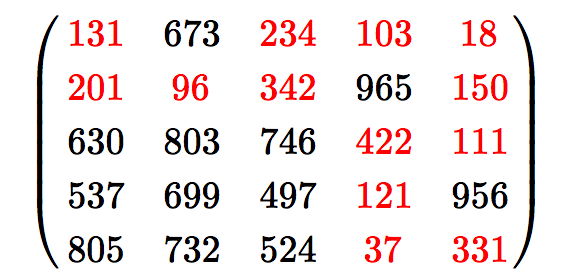

## Problem 83

#### Problem desc
In the 5 by 5 matrix below, the minimal path sum from the top left to the bottom right, by moving left, right, up, and down, is indicated in bold red and is equal to 2297.

Find the minimal path sum, in matrix.txt (right click and "Save Link/Target As..."), a 31K text file containing a 80 by 80 matrix, from the top left to the bottom right by moving left, right, up, and down.

#### Solution

Probably the solution is similar to Problem 81 - 82. Need to check.